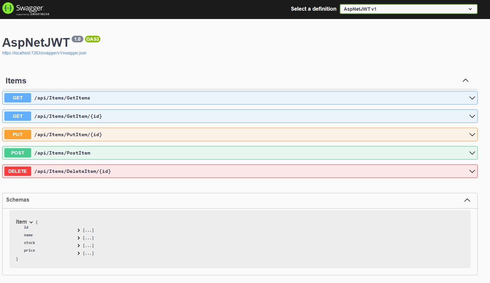
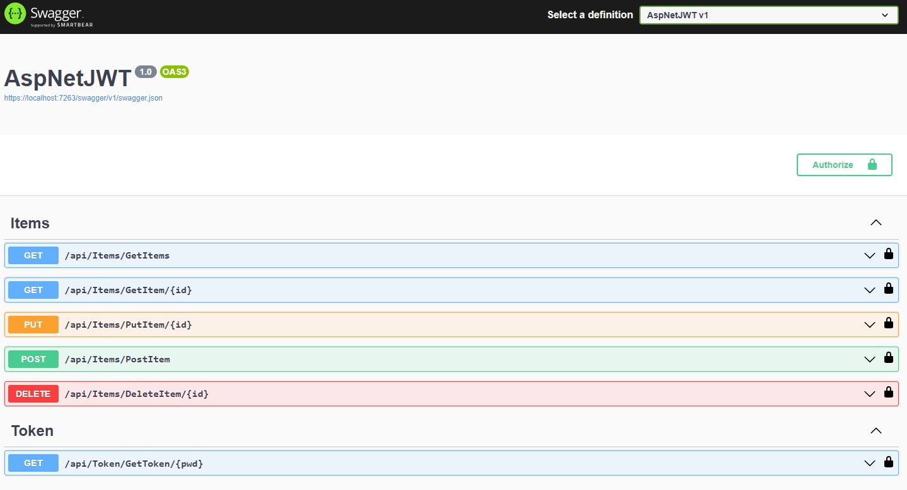

### You can find symmetric or asymmetric key code samples in this repo's branches

#### Web Api Base:</br>
https://github.com/enginunal/AspNetJWT/tree/webapi-base</br>
#### HMAC Symmetric Key Sample:</br>
https://github.com/enginunal/AspNetJWT/tree/webapi-jwt-symmetric-hmac</br>
#### PS256 - (RSASSA PSA SHA-256) Asymmetric Key Sample:</br>
https://github.com/enginunal/AspNetJWT/tree/webapi-jwt-asymmetric-ps256</br>

# AspNetJWT - HMAC256 Sample

## WebApi Base - Preparing dev env

Required tools and cert settings:
```
dotnet dev-certs https --trust
dotnet tool install -g dotnet-aspnet-codegenerator
```

Project folder:
```
mkdir AspNetJWT
cd AspNetJWT
dotnet new webapi
code .
```

Packages:
```
dotnet add package Microsoft.EntityFrameworkCore --version 7.0.10
dotnet add package Microsoft.EntityFrameworkCore.Design --version 7.0.10
dotnet add package Microsoft.EntityFrameworkCore.Tools --version 7.0.10
dotnet add package Microsoft.EntityFrameworkCore.Sqlite --version 7.0.10
dotnet add package Microsoft.EntityFrameworkCore.SqlServer --version 7.0.10
dotnet add package Microsoft.VisualStudio.Web.CodeGeneration.Design --version 7.0.9
```

### Codes and project settings
After that we add project classes and doing some setting stuff:
```
Entities->Item.cs

Infrastructure->ItemsContext.cs
And add some seed data to this class
ctor -> Database.EnsureCreated(); 
OnModelCreating -> Seed

Program.cs->
builder.Services.AddDbContext<ItemsContext>(opt => 
    opt.UseSqlite(builder.Configuration.GetConnectionString("ItemsConnection")  ));

appsettings.json->
"ConnectionStrings": {
    "ItemsConnection": "Data Source=ItemsDb.db"
  }
```
Build to check if everything is ok
```
dotnet build
```

### Adding controller with using aspnet-codegenerator
```
dotnet aspnet-codegenerator controller -name ItemsController -async -api -m Item -dc ItemsContext -outDir Controllers
```

### Swagger Screen



> <sub>You can use SQLite browser to inspect items table. SQLite Browser: https://sqlitebrowser.org/</sub><br/>
> <sub>Base WebApi sample Project is on the webapi-base branch: https://github.com/enginunal/AspNetJWT/tree/webapi-base</sub>

</br>

## WebApi JWT Token HMAC256 Sample 


Packages:
```
dotnet add package Microsoft.AspNetCore.Authentication.JwtBearer --version 7.0.10
dotnet add package System.IdentityModel.Tokens.Jwt --version 6.32.2
```

appsettings.json->
```
  "JwtTokenOptions": {
    "Issuer": "Server1",
    "Audience": "Aud1",
    "SigningKey": "simetrik sifreleme anahtari kullanacagiz",
    "Expiration": 3600
  }
```

Program.cs->
```
builder.Services.AddAuthentication(JwtBearerDefaults.AuthenticationScheme)
    .AddJwtBearer(opts =>
    {
        byte[] signingKey = Encoding.UTF8
        	.GetBytes(builder.Configuration.GetSection("JwtTokenOptions")["SigningKey"]);

        opts.TokenValidationParameters = new TokenValidationParameters
        {            
            ValidIssuer = builder.Configuration.GetSection("JwtTokenOptions")["Issuer"],
            ValidAudience = builder.Configuration.GetSection("JwtTokenOptions")["Audience"],
            IssuerSigningKey = new SymmetricSecurityKey(signingKey)
        };
    });
builder.Services.AddAuthorization();

ve

app.UseAuthentication();//for jwt usage
app.UseAuthorization();
```

Adding token controller 
```
dotnet aspnet-codegenerator controller -name TokenController -async -api -outDir Controllers
```

TokenController.cs->
```
[HttpGet("{pwd}")]
        public async Task<IActionResult> GetToken(string pwd)
        {
            if (pwd != "123") return Unauthorized("Şifre geçersiz.");

            var keyBytes = Encoding.UTF8.GetBytes(_config.GetSection("JwtTokenOptions")["SigningKey"]);
            var symmetricKey = new SymmetricSecurityKey(keyBytes);

            var signingCredentials = new SigningCredentials(
                symmetricKey,
                SecurityAlgorithms.HmacSha256);

            var claims = new List<Claim>()
            {
                new Claim("sub", "eunal"),
                new Claim("name", "engin unal")                
            };

            var roleClaims = new List<Claim>()
            {
                new Claim("role", "readers"),
                new Claim("role", "writers"),
            };

            claims.AddRange(roleClaims);

            var token = new JwtSecurityToken(
                issuer: _config.GetSection("JwtTokenOptions")["Issuer"],
                audience: _config.GetSection("JwtTokenOptions")["Audience"],
                claims: claims,
                expires: DateTime.Now.Add(TimeSpan.Parse(_config.GetSection("JwtTokenOptions")["Expiration"])),
                signingCredentials: signingCredentials);

            var tokenData = new JwtSecurityTokenHandler().WriteToken(token);
            return Ok(tokenData);
        }
```

Program.cs->
```
builder.Services.AddSwaggerGen(c =>
{
    c.SwaggerDoc("v1", new OpenApiInfo { Title = "AspNetJWT", Version = "1.0" });
    c.AddSecurityDefinition("Bearer", new OpenApiSecurityScheme
    {
        Name = "Authorization",
        Type = SecuritySchemeType.ApiKey,
        Scheme = "Bearer",
        BearerFormat = "JWT",
        In = ParameterLocation.Header,
        Description =
            "JWT Authorization header using the Bearer scheme. \r\n\r\n Enter 'Bearer' [space] and then your token in the text input below.\r\n\r\nExample: \"Bearer 12345abcdef\""
    });
    c.AddSecurityRequirement(new OpenApiSecurityRequirement
    {
        {
            new OpenApiSecurityScheme
            {
                Reference = new OpenApiReference
                {
                    Type = ReferenceType.SecurityScheme,
                    Id = "Bearer"
                }
            },
            new string[] { }
        }
    });
});
```

ItemsController.cs->
```
[Authorize]
```

### Swagger Screen



